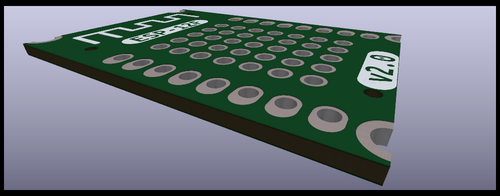

This is ESP-12F interface to connect with the esp-flasher, featuring pogo-pin snap-on design.

* Designed to snap on top of any ESP-12F module without any provisions for programming or debugging in-place

Support this open-source project - buy your fully assembled and tested flasher here http://esp-12f.makerspace.lt/shop

Dev NOTE: before commit, run `./kibot.sh` to regenerate documentation, gerbers and other assets.

* [schematics.pdf](gen/schematics.pdf)
* [pcb.pdf with dimensions](gen/pcb.pdf)

